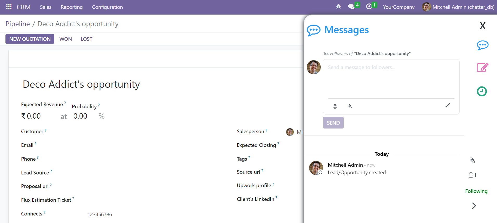
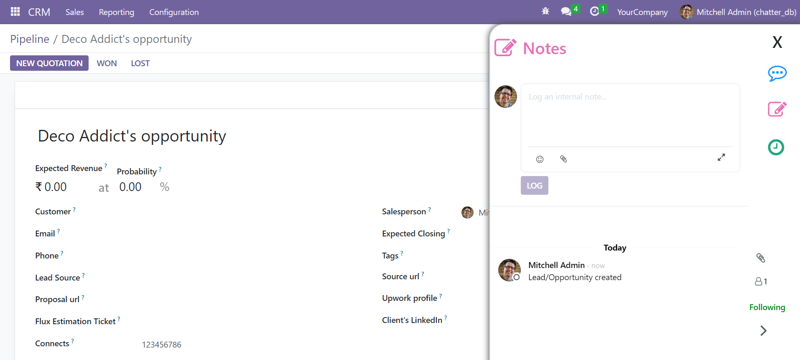
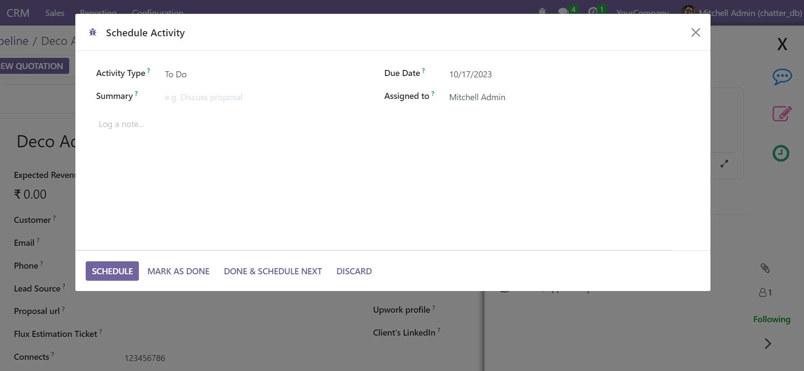

================================================================
Advance Odoo Chatter
================================================================

Advance odoo chatter, this module enhances the functionality and user experience of the existing odoo chatter,
The changes implemented in this module focus on improving the look and feel of the chatter and making it easier and more efficient for users to communicate and collaborate the odoo system.

.. role:: raw-html(raw)
    :format: html

:raw-html:`
`

**Table of contents**

.. contents::
   :local:

Installation
================================================================

**To install this, follow below setps:**

* Just simply mount this module as Odoo's custom module
* Now, Install the module in Odoo from **Main Apps** section.

Usage
================================================================

**How to use this module:**

* Go to **Any FormView**

* On the right side of the form view , you will see sidebar.

* Message Section in Chatter

* Notes Section in Chatter

* Activity Section in Chatter

Change logs
================================================================

* ``Added`` Advance Odoo Chatter module

Support
================================================================

`Zehntech Technologies <https://www.zehntech.com/erp-crm/odoo-services/>`_
