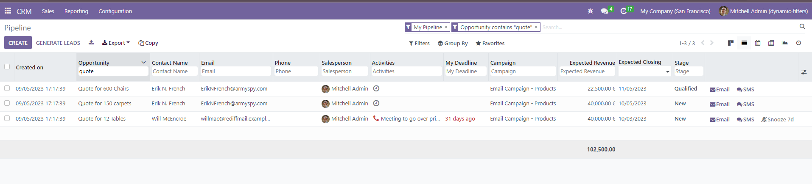
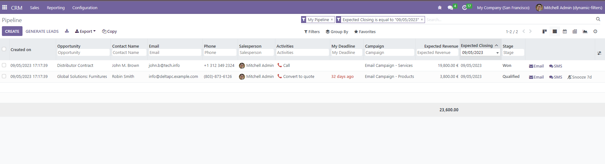
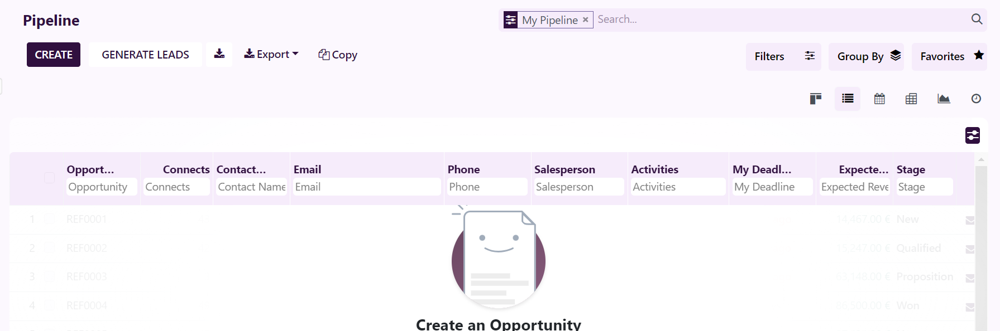
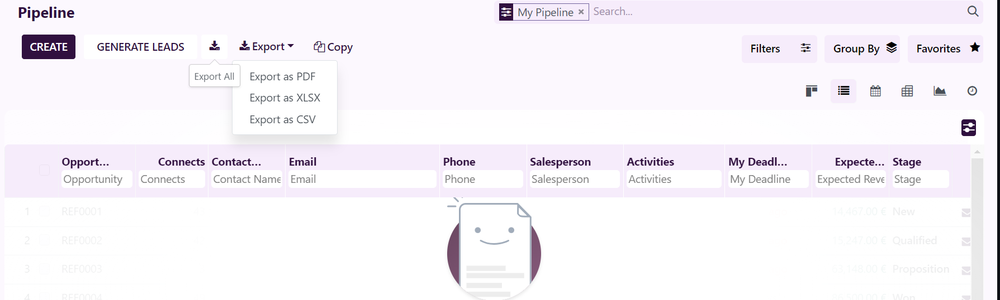

================================================================
Ultimate List View
================================================================

Ultimate List View is a custom Odoo module, enables users to filter records in the list view directly from the header of the table in the list view.
It is created to add multiple filters simultaneously in simple way.

.. role:: raw-html(raw)
    :format: html

:raw-html:`
`

**Table of contents**

.. contents::
   :local:

Installation
================================================================

**To install this, follow below setps:**

* Just simply mount this module as Odoo's custom module
* Now, Install the module in Odoo from **Main Apps** section.

Usage
================================================================

**How to use this module:**

* For date field just select the date from the Date Picker which is present in the header of the date field.

* To remove the date field filter you have to clear the facet of date field from the parent search bar.

* For other fields just write the text you want to search with and hit enter button.

.. figure:: ./static/src/img/search_result.png

* To remove the filter just hit the backspace button.

* To copy the records just click on the copy button present in the control panel:

* To Export records just select the type of file in which you want to export the records.

=============================================================

Dependent modules
================================================================

* CRM
* web
* account
* base

Change logs
================================================================

* ``Added`` Ultimate List View Module

Support
================================================================

`Zehntech Technologies <https://www.zehntech.com/erp-crm/odoo-services/>`_
